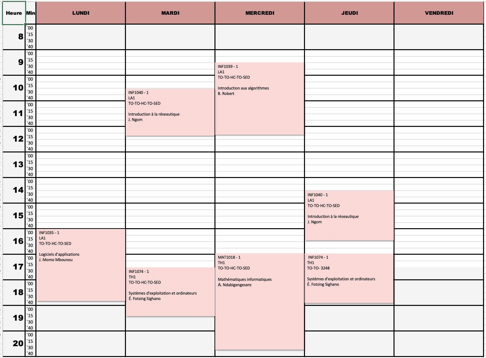

# Automne 2019

# Calendrier GINF

# Calendrier GINQ

## ÉTAPE 1

|     Code	                                                     | Titre du cours                               | Commentaires           |
|:---------------------------------------------------------------|:-------------------------------------------- |:-----------------------| 
| FRA1005	                                                       | Français I                                   | (LB)                   |
| ENG1010	                                                       | Prep. English for Professional Communication |                        |
| MAT1018	                                                       | Mathématiques informatiques                  | (AN)                   |
| INF1035	                                                       | Logiciels d'applications                     | (RN)                   |
| [INF1039](https://gitlab.com/CollegeBoreal/INF1039-202-20A-01) | Introduction aux algorithmes                 | (BR)                   |
| INF1040	                                                       | Introduction à la réseautique                | (LK)                   |
| INF1074	                                                       | Systèmes d'exploitation et ordinateurs       | (EF)                   |

## ÉTAPE 3

|     Code	                                                     | Titre du cours                               | Commentaires           |
|:---------------------------------------------------------------|:-------------------------------------------- |:-----------------------| 
| [INF1006](https://github.com/CollegeBoreal/INF1006-202-20A-01) | Système de gestion de bases de données       |  (BR)                  |
| INF1023                                                        | Réseaux locaux et à distance                 |  (RE)                  |
| [INF1083](https://github.com/CollegeBoreal/INF1083-200-20A-01) | Développement d'applications                 |  (BR)                  |
| INF1084                                                        | Administration Windows                       |  (JMN)                 |
| [INF1085](https://github.com/CollegeBoreal/INF1085-200-20A-01) | Administration Linux                         |  (BR)                  |

